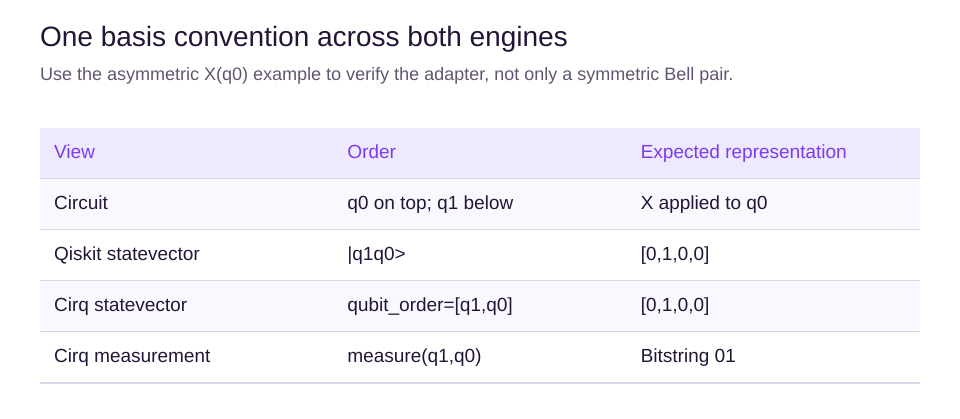
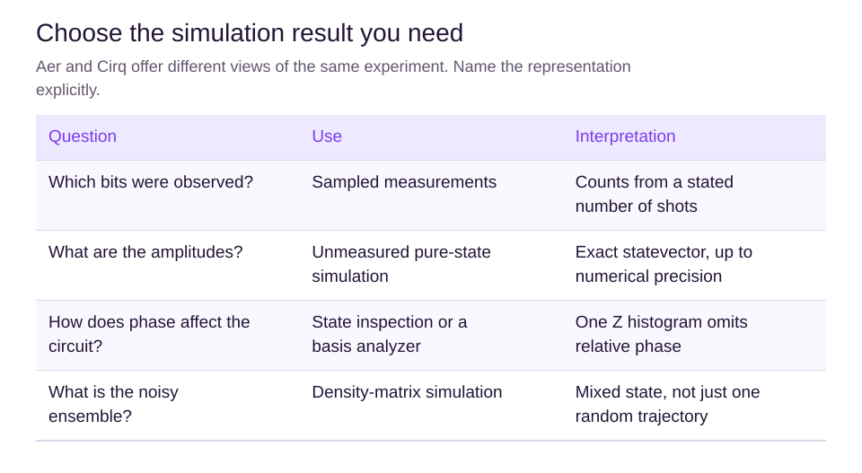

# The same circuit in Qiskit Aer and Cirq

## Learning objectives

Read two framework examples, align bit ordering and choose between exact-state inspection and sampled results.

## Shared experiment

The read-only examples below prepare a Bell pair and sample 1024 measurements. Exact probabilities are 1/2 for 00 and 11. Counts vary; using the same seed in different libraries does not require identical samples.

### Qiskit Aer

```python
from qiskit import QuantumCircuit, transpile
from qiskit_aer import AerSimulator

circuit = QuantumCircuit(2, 2)
circuit.h(0)
circuit.cx(0, 1)
circuit.measure([0, 1], [0, 1])
simulator = AerSimulator(seed_simulator=42)
compiled = transpile(circuit, simulator)
counts = simulator.run(compiled, shots=1024).result().get_counts()
print(counts)  # Keys are c1c0, matching q1q0 here.
```

### Cirq

```python
import cirq

q0, q1 = cirq.LineQubit.range(2)
circuit = cirq.Circuit(
    cirq.H(q0),
    cirq.CNOT(q0, q1),
    cirq.measure(q1, q0, key="bits"),
)
simulator = cirq.Simulator(seed=42)
result = simulator.run(circuit, repetitions=1024)
counts = {
    format(value, "02b"): count
    for value, count in result.histogram(key="bits").items()
}
print(counts)  # Measurement order explicitly makes these q1q0.
```

These snippets use local simulators, not cloud credentials or QPU jobs. They are reading examples until Lab supplies an execution interface.

## Read the code one operation at a time

In Qiskit, QuantumCircuit(2,2) allocates two quantum bits and two classical storage bits. The measure call copies the outcomes of q0 and q1 into their respective classical bits. Transpilation translates a circuit into operations compatible with the chosen target; it is not an extra measurement. The result's count values must add to 1024.

In Cirq, LineQubit names the qubits, Circuit collects operations, and the measurement key names the output record. Repetitions has the same role as shots in the Aer example. Histogram keys are integers here; formatting each as a two-bit binary string retains a leading zero when necessary. Measuring q1 before q0 in the argument list sets result ordering. It does not insert a SWAP gate.

Compare results in stages: first circuit operations and qubit labels, then exact probabilities, then sampled frequencies. If probabilities differ, inspect ordering and angles before blaming sampling. If exact states differ only by a common unit-magnitude factor, their physical predictions still agree.

## Inspect state before measurement

For Aer, prepare a separate unmeasured circuit and call save_statevector() before execution with AerSimulator(method="statevector"). Retrieve the saved state from the result. For Cirq, simulate an unmeasured circuit with qubit_order=[q1,q0] and inspect final_state_vector. A measurement can collapse the state, so the snapshot location matters.

## Catch an ordering mismatch

Bell probabilities look identical after reversing bits. Instead prepare X(q0) with q1 untouched. The expected QuantLearn statevector is [0,1,0,0], and the outcome is 01. Cirq with the order [q0,q1] would instead place the nonzero amplitude at index 2.



In Cirq, include both qubits in qubit_order even when one is idle. In Qiskit, the allocated two-qubit register retains that idle qubit.

## Choose the result you need



To investigate finite measurement counts, use a sampled run with a stated shot count. In Cirq this is simulator.run(circuit, repetitions=N). To investigate amplitudes and phase, simulate an unmeasured circuit and inspect its state. To model a noisy ensemble, choose a density-matrix representation rather than interpreting one random trajectory as the whole ensemble.

The Learn examples are fixed reference experiments. The Lab will let you run related circuits and compare the selected engines. An exact state is useful for understanding the calculation, but a real quantum device does not return its full unknown statevector as one measurement result.

## What you should be able to do next

You should now be able to predict a small circuit, read its diagram and explain the main differences between exact states and measured counts. Practice in Lab will be needed to demonstrate that you can build and debug an unfamiliar circuit.

This course is an introduction, not expert certification. Further study should include deeper linear algebra, mixed-state methods, Fourier transforms and phase estimation, error correction, and larger algorithm implementations. High quiz scores are useful feedback, but they cannot replace independent derivations and practical work.

## Summary

Equivalent circuits should agree on ideal probabilities up to numerical tolerance and statevectors up to global phase. Normalize order before comparison and select the result type that answers your question.

## Chapter quiz

Answer all 10 questions in order: 3 easy checks, 4 medium applications and 3 harder reasoning questions. Use the worked examples if you get stuck. After submitting, read the explanations and revisit the relevant section before retrying.

## Sources

- [Simulators](https://qiskit.github.io/qiskit-aer/tutorials/1_aersimulator.html). Qiskit Aer Documentation.
- [Simulation](https://quantumai.google/cirq/simulate/simulation). Google Quantum AI.
- [Bit-ordering in the Qiskit SDK](https://quantum.cloud.ibm.com/docs/en/guides/bit-ordering). IBM Quantum Documentation.
- [Circuits](https://quantumai.google/cirq/build/circuits). Google Quantum AI.
