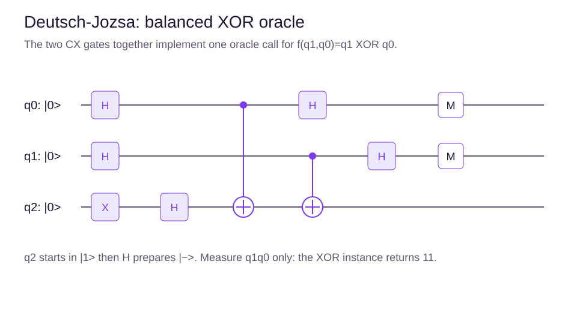
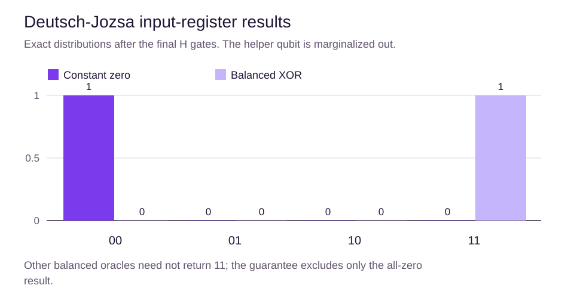

# Deutsch-Jozsa and phase kickback

## Learning objectives

State the promise, trace a two-input example, and interpret the ideal output without overstating its speed advantage.

## The promised problem

A Boolean function of n bits is promised to be either constant, with one output everywhere, or balanced, with output 1 on exactly half the inputs. Deutsch-Jozsa identifies which case holds.

For two input bits, the truth-table outputs 0000 are constant and 0110 are balanced. The outputs 0001 satisfy neither promise, so the algorithm's usual conclusion does not apply.

## Turn a function into an oracle

Use a reversible oracle:

$$
U_f|x\rangle|y\rangle=|x\rangle|y\oplus f(x)\rangle.
$$

Prepare the input register in a uniform superposition. Prepare the helper qubit in $|-\rangle$ using X then H. Because X acting on minus contributes a sign, the oracle attaches $(-1)^{f(x)}$ to each input amplitude. This is phase kickback.

For $f(q_1,q_0)=q_1\oplus q_0$, the helper is flipped by a CX from each input. These two gates implement one complete oracle invocation; query count and physical gate count are different.

## Why the final Hadamards work

After the oracle, apply H to each input and measure the input register. The amplitude of the all-zero output is

$$
\frac{1}{2^n}\sum_x(-1)^{f(x)}.
$$

For a constant function, all terms have the same sign and the probability is one. For a balanced function, opposite signs cancel and that probability is zero.

Our particular XOR oracle gives 11 deterministically. Other balanced functions may give different nonzero outputs or distributions; 11 is not the universal balanced answer. The helper is not needed for the classification.

## Read the truth table before the circuit

A Boolean function returns one bit. The XOR symbol $\oplus$ returns one when its two bit inputs differ and zero when they match. For input order 00, 01, 10, 11, the XOR outputs are 0, 1, 1, 0. The corresponding phase signs are +1, -1, -1, +1.

The sum symbol in the amplitude formula means add one term for each possible input. In this two-input-bit example, divide the sign sum by four. It is zero, which rules out the all-zero output ideally. For a function that always returns one, all four signs are negative. The amplitude is -1, whose squared magnitude is still one. A negative amplitude is not evidence for the balanced case.

The helper remains minus during phase kickback; it supplies the sign when the reversible oracle flips it. Readout for this decision concerns the input register, not an attempt to collect all function values from the helper.

For three input bits there are eight possible inputs. A deterministic classical procedure that sees the same output four times cannot yet rule out a balanced function. A fifth matching result rules it out under the promise. This explains the worst-case count of five without treating a quantum simulator's runtime as a speedup demonstration.

## What the advantage means

The ideal algorithm uses one oracle query. An exact deterministic classical strategy can need $2^{n-1}+1$ queries. Randomized classical testing under a bounded-error requirement changes this comparison. Building the oracle, compiling its gates and coping with noise are additional costs.

## Summary

Check the promise first. Separate one oracle invocation from the gates inside it. Interpret all-zero versus nonzero input-register outcomes, and state the computational model behind the comparison.

## Chapter quiz

Answer all 10 questions in order: 3 easy checks, 4 medium applications and 3 harder reasoning questions. Use the worked examples if you get stuck. After submitting, read the explanations and revisit the relevant section before retrying.

## Sources

- [The Deutsch-Jozsa algorithm](https://quantum.cloud.ibm.com/learning/en/courses/fundamentals-of-quantum-algorithms/quantum-query-algorithms/deutsch-jozsa-algorithm). IBM Quantum Learning / John Watrous.
- [Quantum circuits](https://quantum.cloud.ibm.com/learning/en/courses/basics-of-quantum-information/quantum-circuits). IBM Quantum Learning / John Watrous.
