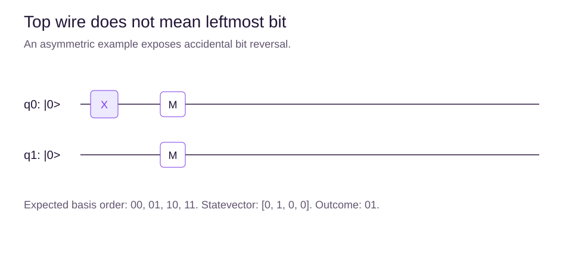
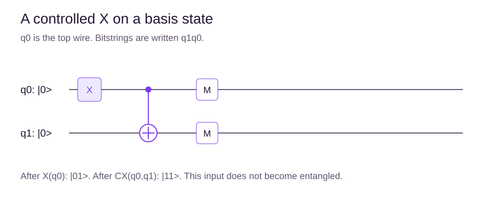

# Multi-qubit states and circuit notation

## Learning objectives

Build a tensor product, read controlled gates, and track wire order separately from bitstring order.

## More qubits mean more amplitudes

Two qubits use four basis states. Throughout QuantLearn, q0 is the top wire and least significant bit. We write basis strings as $|q_1q_0\rangle$ and order statevector entries as 00, 01, 10, 11.

If q1 is 0 and q0 is +, the joint state is $|0\rangle\otimes|+\rangle=(|00\rangle+|01\rangle)/\sqrt2$. A product vector $[a,b]^T\otimes[c,d]^T$ is $[ac,ad,bc,bd]^T$. An n-qubit pure state has $2^n$ amplitudes; they are not all separately readable from one measurement.

## Work through a product state

The tensor-product symbol $\otimes$ means combine the descriptions of separate systems. It does not mean add their vectors. For our ordering, write q1's vector first and q0's second.

Take q1 as $[\sqrt3/2,1/2]^T$ and q0 as $[1/\sqrt2,1/\sqrt2]^T$. Multiply each entry of the first vector by each entry of the second, preserving the order 00, 01, 10, 11:

$
[\sqrt3/(2\sqrt2),\sqrt3/(2\sqrt2),1/(2\sqrt2),1/(2\sqrt2)]^T.
$

The probabilities are $[3/8,3/8,1/8,1/8]$. For outcome 10, q1 contributes its one amplitude and q0 contributes its zero amplitude. Their product squared is $1/8$. Check that all four probabilities sum to one.

A useful circuit-reading routine is to write the starting state, apply one gate, then update the state before moving right. Starting at 01, CX(q0,q1) gives 11; applying the same CX again gives 01. For a superposition, apply this basis-state rule to every term and keep its coefficient. Do not measure the control mentally or choose one branch unless the circuit actually includes measurement.

## Reading the gates

A control dot connected to a plus target means controlled X, also called CX or CNOT. CX(q0, q1) flips q1 when q0 is 1. Its action on our ordered basis is 00→00, 01→11, 10→10, 11→01.

CZ changes the phase of 11 by -1. SWAP exchanges the states of two wires. SWAP can be decomposed into three CX operations with alternating directions.

A CX does not always create entanglement. On input 01 it simply produces 11. The input state matters, as the next chapter demonstrates.

## Circuit time and resources

Read a diagram left to right. A measurement box outputs a classical value; a classical control later in a circuit is different from a coherent quantum control.

Gate count is the number of operations. Circuit depth counts sequential layers under stated scheduling assumptions. H on q0 and H on q1 can share a layer because they act on different qubits. A subsequent CX uses both and requires another layer. Hardware connectivity and compilation can add SWAPs and increase depth.

## Framework ordering

Qiskit displays the highest-numbered bit on the left of a bitstring. Cirq can use an explicit qubit_order. QuantLearn will request [q1, q0] for a two-qubit Cirq statevector and measure in the same order. Comparing only Bell states can hide an ordering bug because both 00 and 11 are unchanged by reversal; the asymmetric 01 example exposes it.

## Summary

Label basis order on every statevector and histogram. Distinguish quantum wires from classical results. Track phase and correlations alongside individual wire values.

## Chapter quiz

Answer all 10 questions in order: 3 easy checks, 4 medium applications and 3 harder reasoning questions. Use the worked examples if you get stuck. After submitting, read the explanations and revisit the relevant section before retrying.

## Sources

- [Quantum information: multiple systems](https://quantum.cloud.ibm.com/learning/en/courses/basics-of-quantum-information/multiple-systems/quantum-information). IBM Quantum Learning / John Watrous.
- [Bit-ordering in the Qiskit SDK](https://quantum.cloud.ibm.com/docs/en/guides/bit-ordering). IBM Quantum Documentation.
- [Circuits](https://quantumai.google/cirq/build/circuits). Google Quantum AI.
