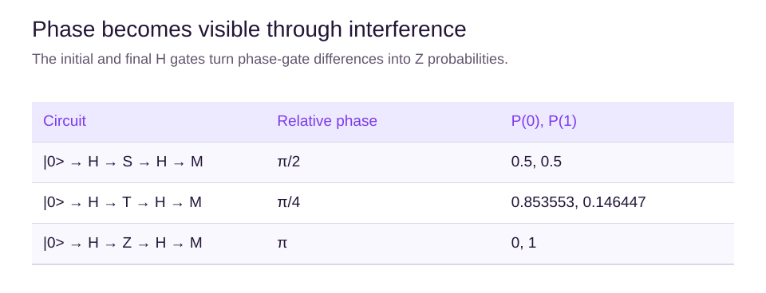
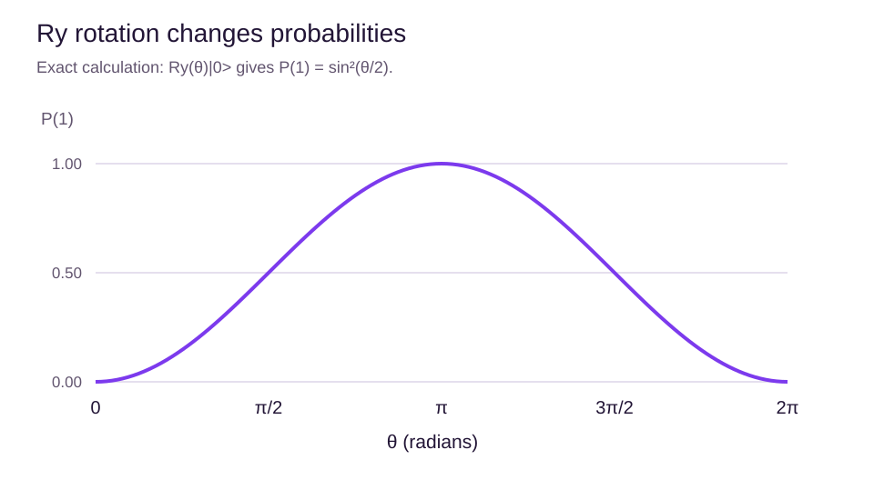

# Phase and rotation gates

## Learning objectives

Distinguish S and T from rotations, use radians, and connect rotations to measurable probabilities.

## Discrete phase gates

The S gate is $\mathrm{diag}(1,i)$ and T is $\mathrm{diag}(1,e^{i\pi/4})$. S adds a relative phase of $\pi/2$ to the 1 amplitude; T adds $\pi/4$. Therefore $S^2=Z$ and $T^2=S$. Neither changes Z probabilities immediately.

Start in 0 and apply H, S, H. The result has probabilities 1/2 and 1/2. Replacing S with T gives $P(0)=(1+1/\sqrt2)/2$, about 0.854. The final H converts phase differences into probability differences.

## Angles without a new mathematics course

A full turn is 360 degrees, or $2\pi$ radians. A half turn is $\pi$ radians and a quarter turn is $\pi/2$. To convert degrees to radians, multiply by $\pi/180$. The half angle in the rotation formula matters: for $R_y(\pi/2)$, calculate sine and cosine at $\pi/4$, not at $\pi/2$.

The notation diag lists the diagonal entries of a matrix; all other entries are zero. It makes S and T easy to apply: multiply the first amplitude by the first entry and the second amplitude by the second entry. The factor $e^{i\phi}$ has magnitude one, so this multiplication changes phase without changing magnitude.

The matrix exponential defines continuous rotation. For the calculations in this chapter, use the displayed action of Ry rather than trying to evaluate an infinite series. A useful check is that the two resulting probabilities add to one because $\cos^2(\theta/2)+\sin^2(\theta/2)=1$.

For a controlled gate, consider a control qubit in a superposition of zero and one. The zero branch applies I while the one branch applies the selected operation. Multiplying only that second branch by a phase is no longer an overall phase of the joint state. This is why isolated-gate equivalence needs care when adding a control.

## Continuous rotations

Rotations are defined by

$$
R_x(\theta)=e^{-i\theta X/2},\quad
R_y(\theta)=e^{-i\theta Y/2},\quad
R_z(\theta)=e^{-i\theta Z/2}.
$$

For example,

$$
R_y(\theta)|0\rangle=\cos(\theta/2)|0\rangle+\sin(\theta/2)|1\rangle.
$$

The probability of 1 is $\sin^2(\theta/2)$. At $\theta=0,\pi/2,\pi$, it is respectively 0, 1/2 and 1. A rotation of $\pi$ around Y takes 0 to 1. A full $2\pi$ rotation changes the statevector's overall sign, which does not change an isolated state's measurement probabilities.

## Conventions worth noticing

S and $R_z(\pi/2)$ agree up to global phase, rather than as identical matrices. This distinction matters when turning a gate into a controlled operation: a phase that was global for an isolated gate can become relative between control branches.

Use explicit rotation helpers such as Qiskit's ry(theta, q) and Cirq's ry(theta). Cirq's powered-gate notation often uses an exponent in units of pi and can differ by global phase; it is not a universal substitute for a rotation angle in radians.

## Summary

S and T supply fixed phase increments. Rotation gates supply adjustable angles. State clearly which units and matrix convention are being used, especially for later variational circuits.

## Chapter quiz

Answer all 10 questions in order: 3 easy checks, 4 medium applications and 3 harder reasoning questions. Use the worked examples if you get stuck. After submitting, read the explanations and revisit the relevant section before retrying.

## Sources

- [Gates and operations](https://quantumai.google/cirq/build/gates). Google Quantum AI.
- [Quantum information: single systems](https://quantum.cloud.ibm.com/learning/en/courses/basics-of-quantum-information/single-systems/quantum-information). IBM Quantum Learning / John Watrous.
