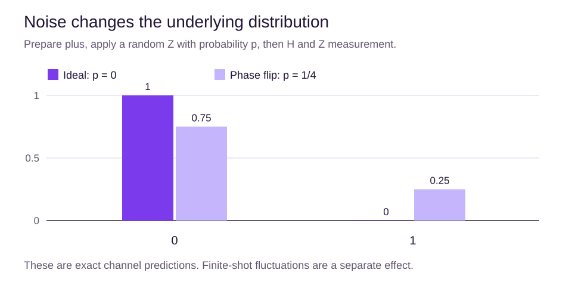
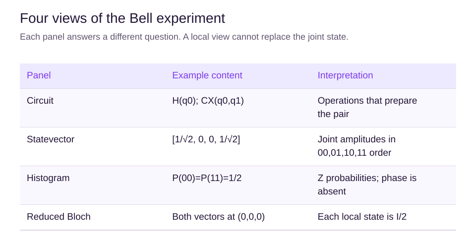

# Simulation, noise and result displays

## Learning objectives

Choose a state representation, separate noise from sampling, and interpret each result panel.

## What a simulator computes

An ideal statevector simulator tracks $2^n$ complex amplitudes for n qubits. A dense density matrix tracks $4^n$ entries and can describe mixed states. Specialized methods can use less memory for suitable circuits, so these dense scaling rules are not universal runtime predictions.

Aer and Cirq both support ideal-state simulation and density-matrix approaches. Sampling produces classical counts from a distribution; exposing an internal statevector is a separate simulator capability.

## Shot noise is not device noise

Even a perfect 50/50 state will usually yield unequal counts in a finite experiment. More shots reduce that sampling uncertainty. Physical noise changes the state or measurement process itself, so more shots can estimate the wrong distribution more precisely.

For an explicit teaching channel, prepare plus, apply Z with probability p and do nothing otherwise, then apply H. The expected final probabilities are P(0)=1-p and P(1)=p. At p=1/4 they are 3/4 and 1/4. This is a phase-flip channel, not a calibrated hardware model.

Before the final H, the state's density matrix is

$$
\rho=\frac12\begin{pmatrix}1&1-2p\\1-2p&1\end{pmatrix}.
$$

At p=1/2, the off-diagonal coherence vanishes. One random pure-state trajectory does not describe the full ensemble.

## Work out what is being averaged

At p=1/4, the channel prepares plus on three quarters of repetitions and minus on one quarter. Before the final H, both branches have 50/50 Z probabilities. After H, they become zero and one respectively, exposing the phase-flip rate in the measured distribution.

At p=1/2 the two branches are equally weighted and the ensemble is I/2. At p=1 the operation is always Z: the state is pure minus before H and pure one afterwards. Increasing p across its whole range does not mean a monotonic increase in mixedness. The maximum mixing for this input occurs at p=1/2.

A statevector trajectory describes one branch of a stochastic calculation. A density matrix describes the weighted ensemble. Averaging amplitudes would give the wrong object; average the corresponding density matrices or the appropriate sampled observables instead.

For three qubits, a dense statevector has eight entries and a density matrix has 64. Adding one qubit doubles the first count and quadruples the second. This explains why choosing a representation matters, but does not determine every simulator's memory use: some exploit structure or use trajectories.

Use the same preparation, gate conventions and noise model when comparing engines. If those assumptions differ, different results need not imply a simulator bug.

## Four complementary panels

A circuit diagram describes the operations. A statevector shows amplitudes and phases for a pure state, with explicit basis ordering. A histogram shows probabilities or counts, with the distinction labeled. Bloch spheres summarize individual qubits but do not retain all joint correlations.

For a Bell pair, the joint statevector is pure while both reduced Bloch vectors are at the center. Showing two pure surface arrows would be incorrect.

## Real hardware has limits

Coherence times, imperfect gates, connectivity and readout errors affect results. Error mitigation and error correction are different ideas and are beyond this demo's implementation. Comparing Aer and Cirq verifies consistent mathematical interpretation; agreement does not prove that a hardware experiment will match.

## Summary

Label the representation, basis, engine, noise assumptions and shot count. Never describe a simulator's exact amplitudes as directly measured hardware output.

## Chapter quiz

Answer all 10 questions in order: 3 easy checks, 4 medium applications and 3 harder reasoning questions. Use the worked examples if you get stuck. After submitting, read the explanations and revisit the relevant section before retrying.

## Sources

- [Simulators](https://qiskit.github.io/qiskit-aer/tutorials/1_aersimulator.html). Qiskit Aer Documentation.
- [Representing noise](https://quantumai.google/cirq/noise/representing_noise). Google Quantum AI.
- [visualization API](https://quantum.cloud.ibm.com/docs/en/api/qiskit/visualization). IBM Quantum Documentation.
